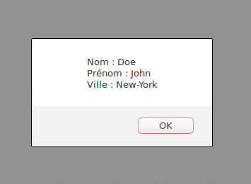

# Exercices JavaScript

**IMPORTANT**

Quand cela est nécessaire, le fichier HTML est fourni.  
Pour la sécurité de votre code, à chaque formulaire verifiez que ce qui est saisi correspond à ce qui est attendu.

**GitHub**

Mettez vos exercices dans un seul repo sur GitHub sinon, ça va être rapidement le chaos sur vos comptes.

## Exercice 1 :

Définir une variable et l'afficher dans une boîte de dialogue.

## Exercice 2 :

Définir trois variables : *nom*, *prenom* et *ville*. Les afficher comme sur l'image ci-dessous.  

## Exercice 3 :

Afficher une boîte de dialogue permettant de saisir son prénom. Afficher dans une boîte de dialogue "Bonjour, " suivi du prénom saisi.

## Exercice 4 :

Refaire **l’exercice 2** en demandant le nom, le prénom et la ville à l’utilisateur.

## Exercice 5 :

Demander à l’utilisateur deux nombres à virgule. Ne garder que la partie entière du premier .  
Les multiplier et afficher le résultat dans une boîte de dialogue.

## Exercice 6 :

Dans un fichier séparé, créer une fonction permettant d’afficher le reste de leur division. L’appeler depuis le fichier html.

## Exercice 7 :

Demander à l’utilisateur sa pointure et son année de naissance. Créer une fonction qui fait les calculs suivants :

1. Multiplier la pointure par 2
2. Ajouter 5 au résultat
3. Multiplier le tout par 50
4. Soustraire l’année de naissance
5. Ajouter au tout 1766

La fonction doit retourner le résultat.
Tester avec votre date de naissance et votre pointure. **Attention : n'utiliser une seule variable « resultat »**.

## Exercice 8 :

Demander à l’utilisateur de saisir son âge. S’il a plus de 18 ans, afficher *" Vous êtes majeur "*. Sinon afficher *" Vous êtes mineur "*.
