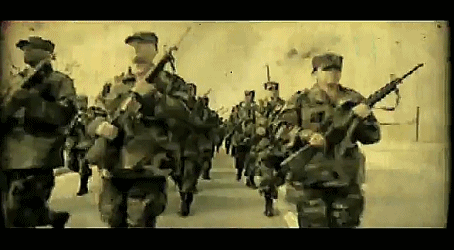

# All hands on deck! Challenge (AHOD)

- repository: `becode-AHOD`  
- team: `true`  
- duration: `6 hours`

## Préparatif
La veille, chacun(e) lit cet article sur le *[User-Centric Design](https://blog.prototypr.io/introduction-to-user-centered-design-approach-b0770974789e)*. 
 et cet article sur [les *Progressive Web Apps*](https://dev.to/pixeline/the-easy-way-to-turn-a-website-into-a-progressive-web-app-77g).

## Votre Mission 

Votre groupe reçoit un projet (un site inexistant ou existant mais pas terrible terrible), et doit réaliser et déployer en quelques heures un *one-pager* qui propose une meilleure version de ce projet, attractif, allant à l'essentiel, en utilisant un framework CSS, avec au moins une animation CSS.

## Qu'est-ce qu'un *one-pager* ?
Comme son nom l'indique, c'est un site d'une page (pas deux, ni trois) visant à obtenir quelque chose du visiteur, via une liste d'arguments et un "call to action" (CTA). Un CTA, c'est par exemple, le gros bouton orange sur [https://castbox.fm](https://castbox.fm). Voici typiquement des actions souhaitées :

- inscription à une mailinglist
- achat
- téléchargement
- abonnement
- formulaire de réservation
- formulaire de contact
- ...

Le tout dans un design adapté au produit et *responsive*.

L'objectif d'un one-pager est de **convaincre** et **convertir l'utilisateur**. Il faut donc absolument aller à l'essentiel, communiquer efficacement, car les gens ne vont pas cliquer sur le CTA pour te faire plaisir mais parce que les arguments que tu as choisi leur parlent. A la moindre hésitation, ils se barreront.

Pose-toi donc la question, par rapport au projet que tu as reçu : qu'est-ce que le client espère de ses visiteurs ? Qu'est-ce qui les fait vivre ?  
Une fois que tu as déterminé cela, identifie les arguments à avancer, et présente le CTA au bon moment de l'argumentaire. (Tu peux le répéter à plusieurs endroits si tu l'estimes nécessaire.)

## Critères

Durant cette phase, le respect de la deadline est **primordial et non négociable**.

- Déploie via une GitHub Pages
- Analyse le client et identifie un CTA qui ait du sens, ainsi que les arguments à avancer pour convaincre l'utilisateur de cliquer.
- Conçois et réalise **au moins une animation CSS** pour guider son regard, ou faciliter sa compréhension de l'objet du site
- Vérifie la sémantique html grâce au [W3C Validator](https://validator.w3.org/)
- Une fois ta page réalisée et en ligne, utilise le [Lighthouse Test](https://developers.google.com/web/tools/lighthouse/) et améliore ton code pour améliorer ses scores dans tous les domaines.
- Essaye d'en faire une Progressive Web App ([guide](https://dev.to/pixeline/the-easy-way-to-turn-a-website-into-a-progressive-web-app-77g))
- Si possible, trouve un nom de domaine gratuit
- Terminé ? Publie le résultat sur ce [formulaire](https://goo.gl/forms/Z544Q93eqeNdfZHI3) avant la fin de la deadline.

## Objectifs pédagogiques
- Introduction au User-Centered Design
- Travail de groupe coordonné avec de nouveaux collaborateurs
- Introduction aux PWA
- Travailler les animations CSS
- Voir comment réaliser en urgence un site web d' une page (= un "one-pager"), sur base de templates existantes. Guerilla style.
- Utiliser des outils de validation, tels que le Lighthouse Test ou le W3C Validator, pour améliorer ses compétences de frontend
- Travailler les compétences acquises dans un cas concret
- Découvrir les vertus du [suffisfaisant](https://fr.wikipedia.org/wiki/Satisficing) comme alternative au perfectionnisme.

Good luck, soldiers.

